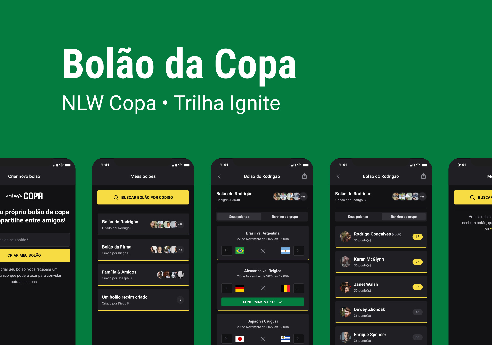

<p align="center" >

</p>


# Nlw
Bootcamp da @rocketseat temático copa do mundo 2022.

Projeto foi realizado em 5 dias, com a mentoria do @diego3g e do @rodrigorgtic, aonde foi desenvolvido uma api, uma versão web e aplicação mobile. Onde um usuário pode criar um 'Bolão' de aposta, e convidar outros usuários, informando seus palpites para os jogos da copa do mundo 2022.

<br />

## Instalação do projeto

1. [NodeJS](https://nodejs.org) Deve ser instalado, Após a instalação do node, Terá que Clonar este repositório:
```sh
  git clone https://github.com/Alexsandro-ms/nlw.git
```

2. Instalar Dependências do Web, server e mobile:
  - Web:
```sh
  cd nlw/server && npm install # ou yarn install
```
  - Server:
```sh
  cd ../server && npm install # ou yarn install
```
  - Mobile:
```sh
 cd ../mobile && npm install # ou yarn install
```
<br />

## Iniciando projeto

  - Server:
```sh
 cd ../server && npm run dev # ou yarn dev
```
  - Web:
```sh
 cd ../web && npm run dev # ou yarn dev
```
  - Mobile:
```sh
 cd ../mobile && npx expo start # ou yarn expo start
```

<br />


### Web
<hr />
<p align="center" >

</p>
<hr />
#### Tecnologias
- React
- NextJs
- Typescript
  - Axios
  - TailWind
        
##### Funcionalidades

1. Criação de bolões
Crie Bolões e compartilhe o código com os seus amigos!

<br />

### Server
<hr />
<p align="center" >

</p>
<hr />

#### Tecnologias
- Node
- Typescript
  - Fastify
    - CORS
    - JWT
  - Prisma
  - Short Unique Id
  - Zod

##### Funcionalidades

1. Autenticação
Login através do google, e geração do token Jwt

2. Perfil de usuário
Retorna Nome e foto de perfil do google

3. Criação de bolões
Cria Bolões e gera códigos únicos para compartilhamento

4. Buscar por bolão
Busca bolão através do código gerado na criação

5. Criação de jogos
cria jogos e armazena data e código do país

6. Envio de palpites
Armazena registros enviado pelo usuário

<br />


### Mobile
<hr />
<p align="center" >

</p>
<hr />

#### Tecnologias
- React Native
- Typescript
  - Axios
  - Dayjs
  - Dotenv
  - Native Base
  - Phosphor Icons
  - React Navigation
  - Expo
    - Auth
    - Font
    - Status Bar
  - React Native Country Flag
    - React Native Svg
    - React Native Svg Transformer

#### Funcionalidades

1. Login de usuário
Login de usuário com autenticação com google.

2. Criação de bolões
Crie seu bolão e compartilhe o código com amigos/parentes/colegas de trabalho.

3. Meus bolões
Veja todos os bolões que você participa.

4. Encontrar bolão
Encontre um bolão através do codigo compartilhado por outro usuário.

5. Palpites
Insira seus palpites para os próximos jogos.

6. Detalhes do bolão
Veja os detalhes do bolão, participantes, próximos jogos, código de envio e todos os seus palpites.

<br />

##### Design
<hr />

[Design no Figma](https://www.figma.com/community/file/1169028343875283461)

